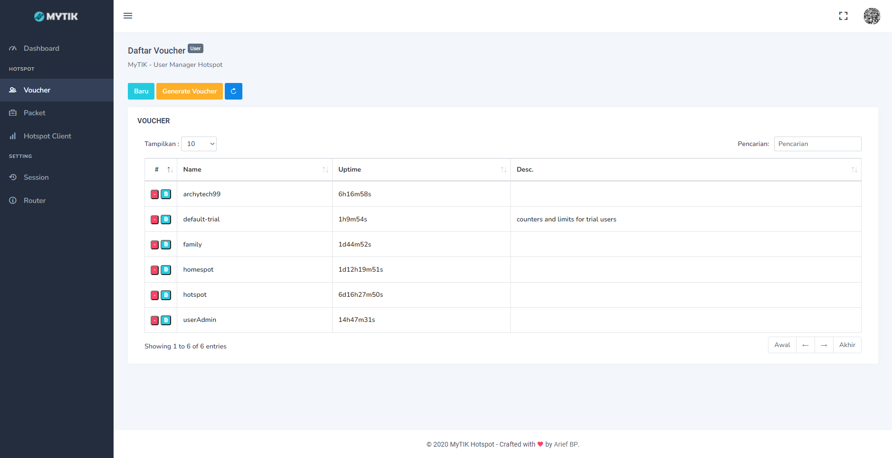

# MyTIK User Manager Hotspot

## About MyTIK

- Simple web application for User Management Hotspot.
- Using framework Laravel 7

## Update `.env` files

- Copy file `.env.example` to `.env`
- Update the following params

```env
ROUTER_HOTSPOT_SERVER=all
ROUTER_HOTSPOT_DNS=http://<your DNS hotspot>

DB_CONNECTION=sqlite
DB_DATABASE=<your path>/sqlite.db
```

## Usage

- Copy file `sqlite.db.std` to `sqlite.db`
- Run command `php artisan key:generate` to create new `APP_KEY`
- Run command `php artisan migrate` to generate table
- Run command `npm run serve-dev` to run local development server

## Preview

- 
- 
- 
- 

## Security Vulnerabilities

If you discover a security vulnerability within MyTIK, please send an e-mail to [Arief BP](mailto:archytech99@gmail.com). All security vulnerabilities will be promptly addressed.

## Contributing

Thank you for considering contributing to the MyTIK project!

## License

The MyTIK project is open-sourced software licensed under the [MIT license](https://opensource.org/licenses/MIT).
